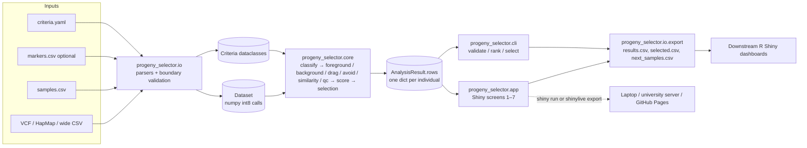

# progeny-selector: plan

## Problem statement

In a marker-assisted backcross (MABC) program a breeder must pick, from hundreds to thousands of segregating progeny per generation across several families, the few plants that carry the donor allele at the target locus, do not carry donor alleles at loci or regions the program wants to avoid, have recovered the most recurrent-parent genome (especially on the non-carrier chromosomes), and carry the shortest donor segment around the target with a recombination close to it on each flank. Today the genotype file is recoded in a spreadsheet or an ad-hoc R script, percent recurrent parent is computed by counting, drag is judged from a heatmap, and the selection list is typed by hand; each generation the script is rewritten. progeny-selector reads the genotype file, a sample manifest and a criteria file, computes every status and metric with documented formulas, applies hard filters before a weighted composite score, ranks overall and within family, and exports the ranked table, the selected IDs and the sample manifest for the next genotyping round. The user navigates cross → family → generation → individual, compares candidates side by side, and never uploads unreleased genotype data to a third party.

## Users and workflow today vs. target

Users: the breeder who decides which plants advance, and the graduate student or technician who runs genotyping and prepares lists; both fluent in R, working on a laptop in a field office during the selection window, with a Snakemake/HPC environment available for batch work.

Today: KASP or array calls arrive as a spreadsheet or VCF; someone recodes calls as A/B/H against the parents, filters carriers by eye, sorts by percent recurrent parent, checks the avoid marker by hand, and writes tag numbers into a planting list. Recombinant selection on the carrier chromosome is rarely done because it needs positions and a window. The BC generation and family structure live in file names.

Target: load genotypes, samples.csv and criteria.yaml; the Validate screen reports contract errors and QC flags; the Navigate screen shows cross → family → generation; the Rank screen lists individuals with pass/fail chips for each target and avoid locus, RPP (total, carrier, non-carrier), drag bounds, recombinant flags, composite score and rank, with column filters and multi-select; the Compare screen shows selected individuals side by side with compact chromosome strips; the Selection screen holds the list with notes and a top-N-per-family helper and shows the expected next-generation composition; the Export screen writes results.csv, selected.csv and next_samples.csv. The CLI does the same in one command on an HPC node; the CSV outputs feed the program's R Shiny dashboards.

## Scope and non-goals

In scope: MABC selection among segregating progeny per generation; foreground selection at target loci defined by marker, region or flanking markers with a required donor state; background selection with count- and map-weighted RPP overall, per chromosome, carrier versus non-carrier; recombinant selection on carrier-chromosome flanks; negative selection at avoid loci and regions; identity-by-state similarity to each parent; QC (missing, heterozygosity, expected values by generation, selfs, outcrosses, swaps, duplicates); hard filters, composite score, ranking, selection lists, top N per family, projected next-generation expectation; navigation cross → family → generation → individual; CSV exports; CLI; Shiny UI runnable locally or as a static Shinylive site.

Non-goals: rich graphical-genotype browsing and QC of finished isolines (the sibling isoline-browser; this tool shows only a compact per-individual chromosome strip); phenotype or trial analysis; marker design; imputation or error correction; multi-donor pyramiding (documented extension); mobile layouts; server-side data storage.

## Reference projects and what is reused

Details, licences and fetched URLs are in docs/reference-repos.md. The weighted RPP model, the linkage-drag definition and the output-table layout (per-chromosome RPP, total, QTL status, drag, selected state, rank, comment) follow Flapjack's MABC analysis [web] https://flapjack.hutton.ac.uk/en/latest/mabc.html and its tutorial [web] https://flapjack.hutton.ac.uk/en/latest/mabc_tutorial.html; Flapjack's QTL "Source" column (DP or RP) is generalised into `required_state` for targets and RP-required avoid loci. The compact strip in the Compare screen borrows the one-row-per-line colour-by-state idea from flapjack-bytes [web] https://github.com/cropgeeks/flapjack-bytes. The A/B/H coding vocabulary follows ABHgenotypeR [web] https://github.com/StefanReuscher/ABHgenotypeR/ and GenoSee [web] https://github.com/hashimotoshumpei/GenoSee. The IBS definition is SNPRelate's [web] https://rdrr.io/bioc/SNPRelate/man/snpgdsIBS.html. Package layout (src package, docs, tests, pytest) follows scikit-allel [web] https://github.com/cggh/scikit-allel and py-shiny [web] https://github.com/posit-dev/py-shiny; the logic/view split follows rhino [web] https://github.com/Appsilon/rhino. BrAPI's Genotyping module [web] https://github.com/plantbreeding/API is the intended later data source. No code was copied from any reference.

## Architecture



`core` is pure: arrays and dataclasses in, arrays and dataclasses out, no I/O, no pandas, no Shiny. `io` is the only place that validates. `app` renders rows and calls `run_analysis`; it computes nothing. The same package runs under CPython locally and under Pyodide in the browser.

## Data model and file contracts

`GenotypeMatrix` stores calls as an int8 array of shape (markers, samples, 2) of allele indices (−1 missing) into a per-marker allele table, so VCF GT, HapMap nucleotides and A/B/H codes share one structure. `Sample` carries sample_id, line_name, role, generation, family_id, notes; `Dataset` joins the two and asserts exactly one recurrent and one donor parent. `Criteria` holds `TargetSpec` and `AvoidSpec` loci (marker, region or flanking pair), flank windows, `BackgroundOptions`, `Weights` and `Filters`. `Classification` is an int8 (markers, samples) state matrix with six states (A, H, B, X, N, U) plus an informative mask. `AnalysisResult.rows` is a list of flat dicts whose column names are the results.csv contract. Every file (genotypes, samples.csv, markers.csv, criteria.yaml, results.csv, selected.csv, next_samples.csv) is specified with column tables and examples in docs/data-formats.md; the input contract is shared with isoline-browser.

## Core algorithms and metrics

1. Parent-of-origin classification (`core/classify.py`). A marker is informative when both parents are called, both homozygous and their alleles differ; otherwise every call at that marker is U (uninformative) with a recorded reason (parents identical; recurrent or donor missing; recurrent or donor heterozygous). At an informative marker a progeny call is A (both alleles recurrent), B (both donor), H (one of each), X (any allele in neither parent), or N (missing). Coded A/B/H input defines allele 0 = recurrent, 1 = donor. This definition is identical to isoline-browser's (labels rp_hom, donor_hom, het, nonparental, missing, uninformative).

2. Foreground status (`core/foreground.py`). A target is a marker, a region (all markers with chrom and start_bp ≤ pos ≤ end_bp) or a flanking pair. Per marker the predicate for `required_state` is hom_donor → B; het → H; either → H or B. Over the locus, counted markers are those with A/H/B calls; with fewer than `min_markers` counted the status is unknown; rule all requires every counted marker to satisfy the predicate, rule any at least one; flanking loci use rule all with both markers required. Result per individual: pass, fail or unknown.

3. Background (`core/background.py`). Contribution s = 1 for A, 0.5 for H, 0 for B; X, N and U leave both sums. Count model: RPP = Σs / n_called. Weighted model: RPP = Σ w s / Σ w with w = min(d_left/2, c/2) + min(d_right/2, c/2), d the distance to the neighbouring informative marker (bp or cM), c the maximum marker coverage (default 10 cM or 4 Mb), chromosome ends bounded by the Wm82.a4.v1 length when positions are in bp [web] https://www.soybase.org/resources/genome_info/; this is Flapjack's model [web] https://flapjack.hutton.ac.uk/en/latest/mabc.html. Reported overall, per chromosome, and over carrier chromosomes (those holding any target) versus non-carrier chromosomes. Expected RPP after n backcrosses without selection is 1 − (1/2)^(n+1): BC1 0.75, BC2 0.875, BC3 0.9375 [web] https://iastate.pressbooks.pub/molecularplantbreeding/chapter/marker-assisted-backcrossing/; selfing generations leave expected RPP unchanged and halve heterozygosity each generation (`core/generation.py`). Theory and context: Hospital and Charcosset 1997, Genetics 147:1469–1485, DOI 10.1093/genetics/147.3.1469 [web] https://academic.oup.com/genetics/article-abstract/147/3/1469/6054126 (foreground marker positioning, background selection, carrier-chromosome recovery); Frisch, Bohn and Melchinger 1999, Crop Science 39:1295–1301, DOI 10.2135/cropsci1999.3951295x [web] https://experts.illinois.edu/en/publications/comparison-of-selection-strategies-for-marker-assisted-backcrossi/ (four-stage selection prioritising carrier-chromosome recombinants cut marker data points by about 75 %); Frisch and Melchinger 2005, Genetics 170:909–917, DOI 10.1534/genetics.104.035451 [web] https://academic.oup.com/genetics/article-abstract/170/2/909/6059341 (selection theory accounting for variance reduction after selection).

4. Linkage drag and recombinant selection (`core/drag.py`). For each target and individual, walk outward from the locus boundary over informative markers on the carrier chromosome, skipping N and X. The max bound is the distance to the first A marker (or to the chromosome end: 0 on the left; the assembly length in bp, or the last mapped marker in cM, on the right), matching Flapjack's "first recombination on each side" [web] https://flapjack.hutton.ac.uk/en/latest/mabc.html; the min bound is the distance to the outermost H/B marker before that A marker (0 if none). Estimate = (min + max) / 2 per side; total = left + right. recombinant_left is true when left_max ≤ the left window (default `flank_window`, 5 cM, per-target override); likewise right. Distances are in cM when every marker has cM and `flank_unit` is cm, else bp with a warning; bp locus boundaries are converted to cM by linear interpolation on the chromosome's map.

5. Avoid criteria (`core/avoid.py`). Same locus resolution and rule machinery with the predicate A (or A/H when `allow_het`); pass, fail or unknown per individual. Policy for unknown is `filters.unknown_avoid_is` (default pass, because no data cannot prove the donor allele is present; the row keeps the unknown chip).

6. Similarity (`core/similarity.py`). IBS to each parent over all markers called in both: per marker, shared alleles / 2 (multiset intersection: 1, 0.5 or 0), averaged; equals SNPRelate's 1 − |g1 − g2| / 2 for biallelic markers [web] https://rdrr.io/bioc/SNPRelate/man/snpgdsIBS.html. Pairwise IBS among progeny on a random subset of at most 2,000 markers finds duplicates (≥ 0.995), skipped above 2,000 individuals.

7. Composite score, ranking, selection (`core/score.py`, `core/selection.py`). Hard filters first: every target must pass (unknown → `unknown_target_is`, default fail), every avoid locus must pass, missing rate ≤ `max_missing_rate` (0.2), and no excluding QC flag (possible_self_or_outcross, possible_outcross, possible_rp_sample, possible_donor_sample) when `exclude_qc_flagged`. Excluded individuals keep their metrics and a `;`-joined `exclusion_reason`. Components in [0, 1]: rpp_noncarrier (falls back to rpp_total when no non-carrier markers), rpp_carrier, drag = 1 − min(1, total_est / carrier chromosome span) averaged over targets, recombinant = flagged flanks / (2 × targets), similarity_rp, completeness = 1 − missing rate. Score = Σ w_k c_k / Σ w_k over non-NaN components; default weights 0.5, 0.2, 0.2, 0.1, 0, 0. Ties break by rpp_total desc, drag_est asc, missing_rate asc, sample_id asc; ranks are dense, overall and within family. `select_top_n(rows, n, per_family)` returns rank_in_family ≤ n (or rank_overall ≤ n). Projection from the selected group's mean A/H/B fractions: backcross → A' = A + H/2, H' = H/2 + B, B' = 0, so expected RPP' = (1 + RPP)/2 and half the offspring carry a heterozygous target; self → A' = A + H/4, H' = H/2, B' = B + H/4, RPP unchanged, 3/4 carry the target (1/4 homozygous). Assumptions: Mendelian segregation, unlinked loci, no selection within the next generation, no distortion, no genotyping error.

8. QC (`core/qc.py`). Per individual: missing rate over all markers; het, hom-donor and non-parental rates over called informative markers; expected het and RPP from the parsed generation. Flags: high_missing; generation_unparsed; possible_self_or_outcross when a BCnF1 shows B calls above 2 % (homozygous donor is impossible in a true backcross apart from error); het_rate_deviates when |observed − expected| > 0.15 (advisory; selected high-RPP plants legitimately deviate); possible_outcross when non-parental calls exceed 2 %; possible_rp_sample or possible_donor_sample when IBS to that parent > 0.995 with het < 0.5 %. Parents: heterozygosity above 2 %, missing above 10 %, fewer than 20 % informative markers, or none, are warnings. Duplicates from pairwise IBS are reported as pairs.

Edge cases: a marker with a heterozygous or missing parent is uninformative rather than guessed; multiallelic markers work by allele index; an individual with no called informative markers has NaN RPP and score and is excluded by the missing-rate filter; a target inside a region with zero called markers is unknown; targets on different chromosomes make several carrier chromosomes; when the map lacks cM for any marker, all cM options fall back to bp with a warning.

## UI walkthrough

Screen 1 Load: file inputs for genotypes, samples.csv, markers.csv (optional) and criteria.yaml, a Load and analyse button, and a status panel quoting contract errors verbatim or the counts and warnings on success (implemented). Screen 2 Validate and QC: informative-marker count, parent warnings, per-individual QC table with flags and expected values (placeholder rendering the real QC objects). Screen 3 Navigate: tree cross → family → generation with breadcrumbs; the selection filters every later screen (select inputs stand in for the tree control in M0). Screen 4 Rank: DataGrid of individuals with rank, family, pass/fail, exclusion reason, composite score, RPP total/carrier/non-carrier, drag, missing rate, QC flags and one status column per target and avoid locus; header filters, sortable columns, multi-row selection, a switch to hide excluded individuals (implemented on the real rows). Screen 5 Compare: one column per selected individual with status chips, per-chromosome RPP, drag bounds and recombinant flags, and a compact 20-row chromosome strip in Okabe-Ito colours (placeholder). Screen 6 Selection list: the selected individuals with notes, "add top N per family", and the projected next-generation composition for backcross or self (implemented on the real rows). Screen 7 Export: results.csv, selected.csv and next_samples.csv downloads (implemented against the writers). Keyboard: Shiny's navbar and inputs are focusable in order; DataGrid supports arrow-key navigation and space/enter selection; status chips carry text labels so colour is never the only cue. Palette: Okabe-Ito, A blue #0072B2, H bluish green #009E73, B vermilion #D55E00, X reddish purple #CC79A7, N grey #999999, U yellow #F0E442; pass/fail/unknown bluish green/vermilion/grey [web] https://raw.githubusercontent.com/wch/r-source/trunk/src/library/grDevices/R/colorstuff.R.

## Technology decisions

Python 3.11+ package with numpy and PyYAML as the only core dependencies; Shiny for Python UI (pandas only for DataGrid); two deployments from one codebase, `shiny run` and a Shinylive static export (docs/adr/0001, 0003). Shared input contract with isoline-browser (0002). MIT licence (0004). Criteria as strict YAML (0005). Six-state classification and Flapjack-style RPP (0006). Hard filters before a bounded weighted composite with fixed tie-breaks (0007). Tooling: ruff (lint and format), mypy, pytest with a reproducible fixture, GitHub Actions on Python 3.11 and 3.12, Conventional Commits, SemVer, Keep a Changelog, MADR.

## Repository layout

```
progeny-selector/
├── PLAN.md                         this document
├── README.md                       what it does, quickstart, status
├── CHANGELOG.md                    Keep a Changelog, 0.1.0 unreleased
├── CONTRIBUTING.md                 conventions
├── LICENSE                         MIT
├── pyproject.toml                  package metadata, ruff, mypy, pytest config
├── .env.example                    twelve-factor variables read only by config.py
├── .gitignore                      caches, site/, user genotype files
├── .github/workflows/ci.yml        ruff, mypy, pytest, fixture reproducibility, shinylive export, Pages deploy
├── docs/
│   ├── data-formats.md             input, criteria and output contracts
│   ├── reference-repos.md          fetched repositories and sources
│   └── adr/0001..0007-*.md         MADR records
├── scripts/make_fixture.py         deterministic synthetic BC2F1 fixture generator
├── src/progeny_selector/
│   ├── __init__.py, __main__.py, cli.py, config.py, constants.py
│   ├── model/    dataset.py (GenotypeMatrix, Sample, Dataset), criteria.py (specs, weights, filters)
│   ├── io/       calls.py, vcf.py, hapmap.py, wide_csv.py, manifest.py, criteria.py, export.py, __init__.py (loader)
│   ├── core/     chrom, generation, classify, foreground, avoid, background, drag, similarity, qc, score, selection, pipeline
│   └── app/      app.py (navbar shell, AppState), requirements.txt (shinylive), screens/ load, qc, navigate, rank, compare, select, export
└── tests/
    ├── conftest.py, test_classify.py, test_status_metrics.py, test_io.py, test_smoke_pipeline.py
    └── fixtures/synthetic_bc2f1/   genotypes.vcf, samples.csv, markers.csv, criteria.yaml, expected_results.csv, README.md
```

## Testing and CI

Unit tests cover classification on all six states and every uninformative reason, generation parsing and expectations, chromosome normalisation, foreground rules (marker, region all/any, flanking, unknown), avoid with and without allow_het, count and weighted RPP with hand-computed weights, drag bounds and recombinant flags in bp and cM including chromosome ends, IBS, composite renormalisation and tie-breaks, every parser (VCF plain and gzip, HapMap, wide nucleotide and coded CSV, manifest rules, marker map, criteria validation). The smoke test loads the fixture (2 parents, 40 BC2F1 progeny in 2 families, 500 markers, 475 informative, planted target, avoid locus, self contaminant, high-missing individual) and compares statuses, exclusion reasons, RPP (total, carrier, non-carrier), drag bounds, recombinant flags, composite scores, advisory flags and ranks against expected_results.csv produced by the generator's independent implementation, then exercises top-N selection, projection, the results writer and the CLI end to end. CI runs ruff check, ruff format --check, mypy, pytest with coverage, regenerates the fixture and fails on any diff, builds the wheel and runs shinylive export on Python 3.12, and deploys the export to GitHub Pages on pushes to main. Later milestones add Playwright tests of the screens and a shared contract test suite with isoline-browser.

## Deployment and cost

Local: `pip install progeny-selector` (or the repository in editable mode) and `shiny run`, or the CLI inside a Snakemake rule on the HPC cluster; no server, no cost. Shared: the CI-built Shinylive site on GitHub Pages, static files only, zero cost, genotype data processed in the browser tab; the first load downloads about 13 MB of Pyodide plus NumPy and pandas [web] https://shiny.posit.co/py/docs/shinylive.html. A university VM running `shiny run` behind the campus network is the alternative for large datasets shared by several users; a Dockerfile is a later addition. Posit Connect Cloud and shinyapps.io are not used because unreleased data would leave the university.

## Milestones

M0 scaffold (complete): package layout, all parsers, criteria reader, six-state classification, foreground/avoid/background/drag/similarity/QC, hard filters, composite, ranking, selection, projection, writers, CLI, Shiny shell with working Load, Rank, Selection and Export screens, fixture and tests, CI, documents. Acceptance: ruff, mypy and pytest pass; the CLI reproduces expected_results.csv on the fixture.

M1 vertical slice: Navigate tree with breadcrumbs driving the Rank filter; Validate screen table; status chips and per-locus columns in the Rank grid; Compare screen with side-by-side statuses and compact chromosome strips; criteria editable in the UI and downloadable; Shinylive export verified in CI. Acceptance: a breeder loads a real BC2F1 KASP or SoySNP6K dataset and produces selected.csv without leaving the browser; the export runs on GitHub Pages.

M2 usable: weighted background model default with map warnings surfaced in the UI; per-target windows; notes persisted in selected.csv; next_samples.csv used as input for the next generation without editing; duplicate detection surfaced; keyboard walkthrough documented; CSV columns frozen and consumed by a downstream Shiny dashboard. Acceptance: two consecutive generations processed with the round-tripped manifest; downstream dashboard reads results.csv unchanged.

M3 hardened: performance on SoySNP50K × 2,000 individuals under 60 s in CPython and documented limits for Shinylive [speculation, to be measured]; streaming VCF parse to bound memory; multi-donor pyramiding (`donor_parent_2`); BrAPI loader; Playwright screen tests; accessibility review; shared contract tests with isoline-browser. Acceptance: contract tests pass in both repositories; performance targets met on the reference laptop.

## Risks and open questions

Marker density on the carrier chromosome limits recombinant selection: with KASP panels of a few markers per chromosome the flank windows must be wider than the marker spacing, and the min/max drag bounds will be far apart; the UI must show both bounds. Missing data at the target marker is the single most consequential input problem; policy is explicit but users may not read it. Weighted versus count RPP disagree on uneven maps; results.csv names the model. Pyodide performance and memory for large VCFs are unmeasured. Open questions for the user: which platform the program genotypes BC progeny on (KASP panel size, SoySNP6K, or 50K) and on which assembly positions are reported (BARCSoySNP6K positions are on Wm82.a2.v1 [web] https://digitalcommons.unl.edu/cgi/viewcontent.cgi?article=2402&context=agronomyfacpub; SoySNP50K on Glyma1.01 [web] https://journals.plos.org/plosone/article?id=10.1371/journal.pone.0054985); whether a genetic map with cM is available for the panel or bp windows suffice; whether the composite weights should default to Frisch et al.'s four-stage lexicographic order instead of a weighted mean; whether two-donor pyramiding is needed in the first season; whether the GitHub Pages site may be public.

## Assumptions

Parents are inbred and nearly homozygous; both parents are genotyped on the same panel as the progeny, or the input is A/B/H-coded; one donor per analysis set; generation labels follow BCnFk; positions in the genotype file and markers.csv are on one assembly; progeny of one generation are analysed together per run; users have Python 3.11+ locally or a current browser for the static site; the sibling projects keep the samples.csv and wide-CSV contracts unchanged.

## Verification status

Run on 2026-09-04 in the scaffold container (Python 3.11.15, ruff 0.15.11, pytest 9.1.1, mypy 2.3.1, numpy 2.4.4, shiny 1.7.0). Commands executed from the repository root with `PYTHONPATH=src` (the package was not pip-installed).

```
$ PYTHONPATH=src python3 -m pytest
........................                                                 [100%]
24 passed in 0.49s

$ ruff check . && ruff format --check .
All checks passed!
46 files already formatted

$ PYTHONPATH=src python3 -m mypy
Success: no issues found in 39 source files

$ python3 scripts/make_fixture.py && diff -r <previous copy> tests/fixtures/synthetic_bc2f1
wrote fixture to .../tests/fixtures/synthetic_bc2f1: 500 markers, 40 progeny, 11 pass; informative 475
fixture unchanged

$ PYTHONPATH=src python3 -m progeny_selector validate --genotypes tests/fixtures/synthetic_bc2f1/genotypes.vcf \
    --samples tests/fixtures/synthetic_bc2f1/samples.csv --markers tests/fixtures/synthetic_bc2f1/markers.csv \
    --criteria tests/fixtures/synthetic_bc2f1/criteria.yaml
genotypes: 500 markers x 42 samples; coded=False; cM map=yes
samples.csv: 42 rows; progeny/candidates=40
informative markers: 475
QC-flagged individuals: 7

$ PYTHONPATH=src python3 -m shiny run src/progeny_selector/app/app.py --port 8123   (20 s) ; curl -s -o /dev/null -w "%{http_code}" http://127.0.0.1:8123/
200   (page title "progeny-selector")
```

Not verified: `shinylive export` (pip install shinylive failed in this container while building the lzstring wheel; the CI step is written but has not run); the Shiny screens beyond serving the shell (no browser automation here); the GitHub Actions workflow itself (no repository yet); behaviour on real SoySNP50K-scale data (fixture is 500 markers). File count and size are recorded in the final report.
